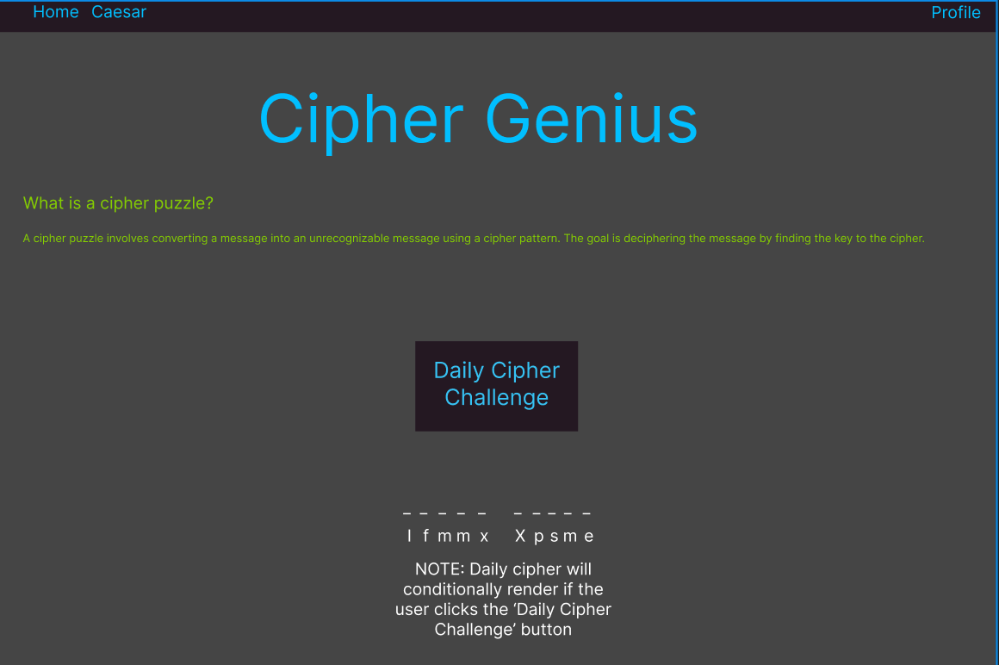

# Cipher Genius

This is a web based cipher based puzzle game. You can create an account and it will track the number of ciphers you have solved in each category and the time it took to solve the cipher. If you don't want to create an account you have the option to continue as a guest as solve cipher puzzles.



## Delpoyed Site
- Coming soon

## Back End Repo
[Cipher Genius Back End](https://github.com/MiTOBrien/cipher_genius_be)

## Technology Used
- [Vue](https://vuejs.org/) 3.5.13 installed with Vite 6.1.0 for the front end
- Vue Router 4.5.0
- JavaScript
- Cypress 14.0.3 for end to end testing
- ESlint and Prettier extensions in VSCode

## Getting Started
To run this locally clone this repository onto your local machine. Change directory into the cipher-genius-fe directory and run npm install to install all dependiences. To launch the front end application:

```sh
npm run dev
```
NOTE: To utilize the login functionality and other aspects of game tracking you will also need to clone down, install, and have the back end running.

## Testing Suite

### Run End-to-End Tests with [Cypress](https://www.cypress.io/)

```sh
npm run test:e2e:dev
```

This runs the end-to-end tests against the Vite development server.
It is much faster than the production build.

But it's still recommended to test the production build with `test:e2e` before deploying (e.g. in CI environments):

```sh
npm run build
npm run test:e2e
```

### Lint with [ESLint](https://eslint.org/)

```sh
npm run lint
```
